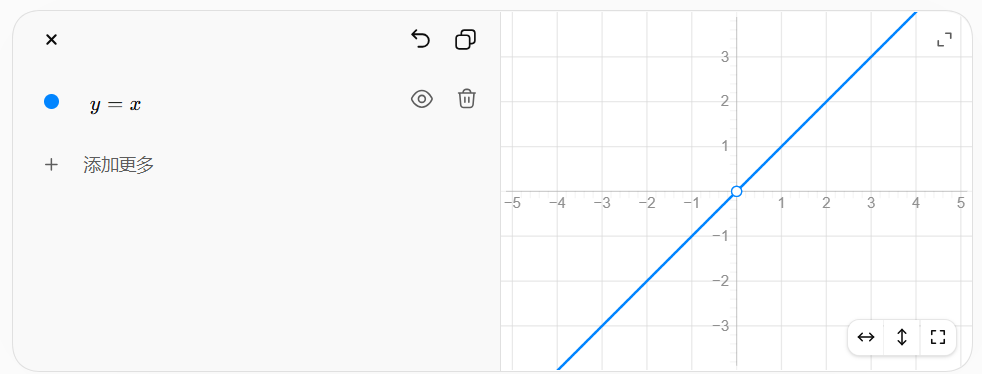

Day 3 建议正式进入：

# Day 3：ReLU + Pooling + 最小 CNN

你 Day 1 已经把 **Tensor / 图片 shape** 搞清楚，Day 2 已经把 **Conv2d 的 filter、weight shape、滑动、stride、padding、out_channels** 基本串起来了。按你当前这条“手写 Mask R-CNN”路线，下一步最合适的不是立刻碰 ResNet，而是先回答一个核心问题：

> **只有 Conv2d，为什么还不能组成真正有用的 CNN？**

你之前的进度摘要里也已经把 Day 3 定成了 `ReLU + Pooling + 最小 CNN`。

---

这个问题问到了根子上！你之所以觉得脱节，是因为**教程通常只告诉你“Shape变化”**，但没带你钻进**“具体数字怎么算出来的”**。

现在，请你忘记 Shape，忘记 Batch，我们只用 **“一个立体方块（1个通道）”** 和 **“一个滑动窗口”**，一步一步看代码背后的数学到底在干什么。

我带你用 **“眼睛盯着一个窗口”** 的方式，把卷积和池化彻底走一遍。

---

### 第一步：先看输入（一张 4x4 的灰度图）
假设我们只有 1 个通道（为了让你看清数字），输入矩阵长这样：

```text
输入 X (1, 1, 4, 4)：
[ 1   2   3   4 ]
[ 5   6   7   8 ]
[ 9  10  11  12 ]
[ 13 14  15  16 ]
```

---

### 第二步：看“卷积”（数学 + 伪代码流程）

**数学操作**：**对应位置相乘，再全部相加（再加偏置）。**
假设卷积核（3x3）长这样，偏置 b=0：

```text
卷积核 W (3x3)：
[ 0   1   0 ]
[ 1   1   1 ]
[ 0   1   0 ]
```

**代码背后的手算流程（只算第一个位置）：**

1. 窗口定位：核覆盖左上角 3x3 区域（1,2,3 / 5,6,7 / 9,10,11）。
2. 数学运算：对应格子相乘，然后求和。
   `(1*0) + (2*1) + (3*0) + (5*1) + (6*1) + (7*1) + (9*0) + (10*1) + (11*0)`
   计算得：`0 + 2 + 0 + 5 + 6 + 7 + 0 + 10 + 0 = 30`。
3. 输出：输出特征图的第一个格子填上 `30`。

**用伪代码理解（概念性循环，非实际高性能代码）：**
```python
# 卷积在底层就是 3 层循环（只算一个输出点）
for 输出高度:
    for 输出宽度:
        # 拿出输入的一块 [3, 3]
        窗口 = 输入[高度:高度+3, 宽度:宽度+3]
        # 对应位置相乘再求和（数学上的点积）
        结果 = (窗口 * 卷积核).sum() + 偏置
        输出[高度, 宽度] = 结果
```
**核心区别**：卷积每次算出一个数字，**是把 9 个输入数字“揉碎”加权合并**，变成了 1 个新数字。

---

### 第三步：看“池化”（数学 + 伪代码流程）

**数学操作**：**只看最大的那一个数字（Max）**。
假设池化核（2x2），步长 2。

**代码背后的手算流程（只算第一个位置）：**

1. 窗口定位：核覆盖左上角 2x2 区域（1,2 / 5,6）。
2. 数学运算：**没有乘法，没有加法（除了比较）**。直接在里面挑最大的数。
   看这 4 个数：`1, 2, 5, 6`。最大的是 `6`。
3. 输出：输出特征图的第一个格子填上 `6`。

**用伪代码理解（概念性循环）：**
```python
# 池化在底层就是 2 层循环
for 输出高度:
    for 输出宽度:
        # 拿出输入的一块 [2, 2]
        窗口 = 输入[高度:高度+2, 宽度:宽度+2]
        # 直接取最大值（无乘法运算）
        结果 = 窗口.max()
        输出[高度, 宽度] = 结果
```
**核心区别**：池化算出一个数字，**只是从 4 个数字里“挑”了一个最强（最大）的**，其他 3 个直接扔掉。

---

### 第四步：联系你“多通道”的疑问（立体视角）

现在把图片从“灰度的（1层）”变成“彩色的（3层 RGB）”。

**卷积的操作（有 C 维度参与）**：
当输入变成 `[3, 4, 4]` 时，你的卷积核也必须是 `[3, 3, 3]`（3层高）。
数学变成：**在 27 个格子里（3层×3×3），对应位置相乘，然后全部加在一起，变成 1 个数字。**
也就是说：**卷积会强行把不同 Channel 的数字“混在一起”求和。**

**池化的操作（无视 C 维度）**：
当输入变成 `[3, 4, 4]` 时，你的池化核还是 `[2, 2]`（没有 3 这一维）。
数学变成：**先在 R 通道的 4 个格子里挑最大，再在 G 通道的 4 个格子里挑最大，再在 B 通道的 4 个格子里挑最大。**
也就是说：**池化把 R/G/B 看成三个独立的楼层，各挑各的，绝不把红色和蓝色的数字混在一起计算。**

---

### 总结：把“数学”和“代码”串起来的一句话

-   **卷积（Conv2d）** 在底层代码里做的数学是 **“乘加（Mul + Add）”**。它必须在 **C（通道）** 维度上进行求和，所以它能改变通道数，因为它把多个通道融合成了 1 个。
-   **池化（MaxPool2d）** 在底层代码里做的数学是 **“比较（Comparison）”**。它只在 **H/W（平面）** 上移动，**永远不碰 C 维度**，所以它无法改变通道数，因为它只是对每一个楼层单独“挑最大的”。

以后你写代码时，盯着 `Conv2d` 你就想“它在做乘加混合”，盯着 `Pool` 你就想“它只是个平面放大镜，在挑最大”。数学公式和代码的桥梁就彻底通了。

---

## 今天最终要搞懂这一条完整数据流

```text
图片
[B, 3, H, W]

↓ Conv2d

局部特征
[B, C1, H1, W1]

↓ ReLU

保留 shape
[B, C1, H1, W1]

↓ Pooling

空间尺寸缩小
[B, C1, H2, W2]

↓ 再一次 Conv + ReLU + Pool

更高级的特征
[B, C2, H3, W3]

↓ Flatten

[B, N]

↓ Linear

[B, num_classes]

↓ logits

每个类别一个分数
```

**今天最重要的不是背 API，而是你能一路预测 Tensor shape。**

---

# 1. 第一部分：先学 ReLU

先不要急着写 CNN。

创建：

```text
study/
└── 01_cnn/
    ├── 02_relu_pooling_cnn.py
    └── 02_relu_pooling_cnn.md
```

先做一个最小实验：

```python
import torch
import torch.nn as nn

x = torch.tensor([
    [-2., -1., 0., 1., 2.]
])

relu = nn.ReLU()

y = relu(x)

print(x)
print(y)
```

### 在运行前，你先自己预测

```text
输入：
[-2, -1, 0, 1, 2]

ReLU 后：
?
```

你最终应该自己总结出：

```text
ReLU(x) = max(0, x)
```

也就是：

```text
负数 → 0
正数 → 原样保留
```

然后检查：

```python
print(x.shape)
print(y.shape)
```

你应该发现：

```text
ReLU 一般不会改变 Tensor shape。
```

---

## 你今天要真正理解的问题

### 为什么 Conv 后面要加 ReLU？

这是 Day 3 的第一个核心问题。

Conv 本质上做的是：

```text
乘法
+
加法
```

例如：

```text
y = wx + b
```

哪怕连续堆很多层：

```text
Conv
↓
Conv
↓
Conv
```

如果中间没有非线性，本质上仍然可以合并成一个更大的**线性变换**。

可以先非常粗略地理解成：

```text
线性层
+
线性层
+
线性层

仍然只是线性
```

而现实图片里的关系不是这么简单的。

所以：

```text
Conv
↓
ReLU
↓
Conv
↓
ReLU
```

中的 ReLU 给网络加入了：

> **非线性表达能力。**

今天不需要深入证明，但你要能解释这句话。

---

这里的“非线性表达能力”，可以理解成：

> **网络有能力把输入空间“掰弯、折叠、切开”，从而表示复杂关系，而不只是做一次直线/平面的变换。**

先从最简单的一维情况看。

如果只有线性变换：

$$
y = wx+b
$$

它画出来永远是一条直线。你连续做两次：

$$
y_1=w_1x+b_1
$$

$$
y_2=w_2y_1+b_2
$$

代进去：

$$
y_2=w_2(w_1x+b_1)+b_2
$$

整理：

$$
y_2=(w_2w_1)x+(w_2b_1+b_2)
$$

你会发现，还是：

$$
y=ax+c
$$

也就是说，**堆再多层线性变换，最后还是一条直线。**

---

而 ReLU 是：

$$
\operatorname{ReLU}(x)=\max(0,x)
$$

也就是：

$$
\operatorname{ReLU}(x)=
\begin{cases}
0,&x<0\\
x,&x\ge 0
\end{cases}
$$

它不是一整条直线，而是“折了一下”。



左边输入小于 0 时，全部压成 0；右边大于等于 0 时继续保留。

关键就在这里：

> **不同输入区域，ReLU 会让网络走不同的数学关系。**

这就是非线性的来源。

---

## 为什么“分段”就能增强表达能力？

假设卷积先算出：

$$
z=wx+b
$$

然后经过 ReLU：

$$
y=\max(0,wx+b)
$$

那么输入会分成两个区域：

```text
wx+b < 0
→ 输出 0

wx+b ≥ 0
→ 输出 wx+b
```

也就是说，同一个神经元对不同输入不再是一套统一规则。

它相当于在说：

```text
如果检测到的这个特征“不够像”
→ 关掉它

如果这个特征“足够明显”
→ 把它传下去
```

多个 ReLU 放在一起，就可以把输入空间切成很多区域。

例如：

```text
区域 A → 使用一种线性关系
区域 B → 使用另一种线性关系
区域 C → 又是一种线性关系
...
```

所以神经网络虽然每一个小区域里仍然近似是线性的，但**整体已经不再是一个单一线性函数**。

这叫：

> **分段线性（piecewise linear）**

而分段线性函数整体是**非线性函数**。

---

## 可以用“折纸”理解

没有 ReLU 时，网络只能对一张纸做：

```text
平移
旋转
拉伸
压缩
```

不管你做多少次：

```text
旋转
↓
拉伸
↓
旋转
↓
压缩
```

纸还是一张没有折过的平面。

ReLU 相当于允许：

> **沿某条线把纸折一下。**

于是：

```text
Linear
↓
ReLU   ← 折一次
↓
Linear
↓
ReLU   ← 再折一次
↓
Linear
```

多次以后，网络就可以形成非常复杂的形状。

这就是为什么“深层 + 非线性激活”比“单纯堆很多 Conv”强得多。

---

## 放到图片里理解会更直观

比如一个卷积核在检测“竖边缘”。

卷积后的某个位置可能得到：

```text
位置 A： 5.2
位置 B： 2.1
位置 C：-1.3
位置 D：-4.7
```

可以粗略理解：

```text
正值较大
→ 这个位置符合当前 filter 想找的模式

负值
→ 不符合，甚至方向相反
```

经过 ReLU：

```text
5.2  → 5.2
2.1  → 2.1
-1.3 → 0
-4.7 → 0
```

于是：

```text
Conv
负责问：
“这里有没有我想找的特征？”

↓

ReLU
负责形成一种门控：
“符合的继续往下传，
这一侧不符合的先压成 0。”
```

注意，这只是帮助理解的直觉。ReLU 并不是严格意义上的“判断器”，它本质仍然只是 `max(0,x)`。

---

# 更关键的是：下一层因此能组合特征

假设第一层 CNN 学到了：

```text
Channel 1：竖边缘
Channel 2：横边缘
Channel 3：斜边缘
Channel 4：某种颜色变化
...
```

ReLU 后，会形成很多：

```text
这里激活
那里不激活
```

的模式。

第二层卷积看到的就不再只是原始 RGB，而可以学习：

```text
竖边缘 + 横边缘
→ 角点

几个角点 + 曲线
→ 某种局部形状

局部形状组合
→ 眼睛 / 叶片 / 豆粒边界

更高级组合
→ 完整物体
```

因此：

```text
RGB
↓
Conv + ReLU

简单特征
边缘、纹理

↓
Conv + ReLU

局部形状

↓
Conv + ReLU

物体部件

↓
Conv + ReLU

更高级语义
```

这里 ReLU 的作用不是“自己识别眼睛”，而是让一层层复杂组合成为可能。

---

# 最值得你记住的数学区别

### 没有 ReLU

```text
Linear
↓
Linear
↓
Linear
↓
Linear
```

可以整体压缩成：

```text
一个 Linear
```

所以深度几乎失去了意义。

### 有 ReLU

```text
Linear
↓
ReLU
↓
Linear
↓
ReLU
↓
Linear
```

因为：

$$
\operatorname{ReLU}(Ax)
$$

不能简单整理成：

$$
Bx
$$

所以这些层**不能再合并成一个线性层**。

网络真正获得了“深度”。

---

## 你可以这样理解“非线性表达能力”

“表达能力”其实是在问：

> **这个模型能够表示多复杂的输入 → 输出关系？**

线性模型只能表达类似：

```text
输入变化一点
↓
输出按照固定比例变化
```

而加入 ReLU 后可以表达：

```text
在这种情况下这样处理

但是进入另一个区域以后
换一种处理方式
```

于是模型可以逼近非常复杂的函数。

---

### 一句话版本

> **Conv 负责学习“怎么组合输入”，ReLU 负责让不同输入区域产生不同响应规则；正因为 ReLU 把一个统一的线性关系切成了多个区域，整个网络才能表示复杂的非线性关系。**

你现在其实已经碰到了一个非常关键的 CNN 原理。下一步很适合做一个**只有 1 个输入数字、2 个 Linear/ReLU 的手算例子**，亲眼看见“没有 ReLU 时三层能合并，有 ReLU 后为什么合并不了”。这个例子搞懂以后，“非线性”基本就不再抽象了。

---

这里的“激活/不激活”，本质上是在说：

> **某个卷积核在某个位置，算出来的响应值是不是大于 0。**

比如某个 filter 扫过一张图，得到一张 feature map：

```text
Conv 输出：

 2.3   -1.2   0.7
-0.5    3.1  -2.0
 1.4    0.2  -0.8
```

经过 ReLU：

```text
ReLU 后：

2.3   0   0.7
0    3.1  0
1.4  0.2  0
```

所以：

```text
> 0 的位置
→ “激活”

≤ 0 的位置
→ 被 ReLU 变成 0
→ “不激活”
```

## 那“激活模式”是什么？

不是一个单独数字，而是：

> **整张 feature map 上，哪些位置亮、哪些位置为 0 的空间分布。**

例如：

```text
0  3  0  0
0  5  0  0
0  4  0  0
0  2  0  0
```

你可以粗略看到：

```text
    ↑
这一列一直激活
```

这可能表示：

> 这个 filter 在这一列附近持续检测到了它擅长响应的模式，比如一条竖直边缘。

另一个 filter 可能得到：

```text
0  0  0  0
4  5  3  2
0  0  0  0
0  0  0  0
```

它可能更像是在响应：

```text
────────
横向结构
```

所以所谓：

```text
这里激活
那里不激活
```

其实是在描述：

> **一个 filter 在图片不同空间位置上的响应分布。**

---

# 为什么 ReLU 后会形成这种模式？

因为 Conv 本来就在每一个位置分别算一个分数。

假设一个卷积核比较喜欢“竖直边缘”。

它扫描图片：

```text
位置 A：
很像竖边缘
→ Conv 输出 4.8

位置 B：
有点像
→ 输出 1.2

位置 C：
不像
→ 输出 -2.4

位置 D：
方向相反
→ 输出 -5.1
```

经过 ReLU：

```text
A → 4.8
B → 1.2
C → 0
D → 0
```

于是整张 feature map 自然就变成：

```text
哪里符合这个 filter 学到的模式
→ 那里有正响应

哪里不符合
→ 很可能变成 0
```

因此你会看到一个空间上的“激活图”。

注意一个细节：

> **不是 ReLU 凭空创造了特征模式。**

更准确地说：

```text
Conv
先产生正负响应

↓

ReLU
把负响应截断为 0

↓

于是“哪些地方有正响应”
变得更加明显
```

---

# 更关键的问题：怎么从“简单特征”变成“高级语义”？

这里的核心不是“某一层突然理解了眼睛”。

而是：

> **后一层卷积会把前一层多个 feature map 当成自己的输入，然后组合这些已有特征。**

这和你 Day 2 学的多通道卷积完全是同一个机制。

假设第一层输出：

```text
[B, 64, H, W]
```

意味着：

```text
64 张 feature maps
```

可以暂时想象其中有些 filter 学成了：

```text
Channel 1 → 竖边缘
Channel 2 → 横边缘
Channel 3 → 左斜边缘
Channel 4 → 右斜边缘
Channel 5 → 某种颜色变化
Channel 6 → 某种纹理
...
```

注意，这只是便于理解的例子。真实网络里的 channel 不一定能这么干净地命名。

---

## 第二层看到的已经不是 RGB

第一层的输入：

```text
R
G
B
```

而第二层的输入可能是：

```text
64 个 feature channels
```

也就是：

```text
竖边缘响应图
横边缘响应图
斜边缘响应图
纹理响应图
颜色变化响应图
...
```

第二层的一个 filter 的 shape：

```text
[64, 3, 3]
```

你 Day 2 已经学过：

> 一个 filter 会同时读取全部输入 channels。

所以第二层可以学：

```text
如果这里：

竖边缘强
+
横边缘强
+
它们空间位置刚好相邻

→ 我就强烈响应
```

这就可能形成：

```text
┌
```

这样的“角”。

所以：

```text
第一层：
边缘

↓

第二层：
边缘之间的组合

↓

角点、曲线、简单纹理、局部轮廓
```

---

# 举一个非常具体的例子：从线到“眼睛”

假设第一层有几个 channel：

```text
C1：检测左斜线  /
C2：检测右斜线  \
C3：检测水平线  —
C4：检测暗色区域
```

第二层某个 filter 会同时看这些 channel。

如果某个局部区域出现：

```text
/      \
 \____/
```

并且内部又有暗区域：

```text
   ●
```

那么第二层或更深层就可以对这种“组合关系”产生较大响应。

继续往后：

```text
局部弧线
+
暗色圆形
+
另一侧弧线
```

可以被更深层组合成：

```text
“像眼睛的结构”
```

再深一层可能同时看到：

```text
左眼模式
+
右眼模式
+
鼻子模式
+
它们相对位置合理
```

于是可能形成：

```text
“脸部区域”
```

再往后：

```text
脸部
+
躯干
+
四肢
```

可能对应：

```text
“人”
```

---

# 为什么“更深层”能看到更大的东西？

这还跟一个非常重要的概念有关：

## 感受野

第一层一个 `3×3` 卷积，只直接看：

```text
原图的 3×3 区域
```

但第二层的一个位置，虽然它也使用 `3×3` 卷积，它看的却是：

```text
第一层 feature map 的 3×3 区域
```

而第一层每个点本身又来自原图的 `3×3`。

所以第二层一个点对应到原图时，实际能间接利用更大的区域。

不断叠层：

```text
第 1 层
看很小局部

↓

第 2 层
看更大局部

↓

第 3 层
再更大

↓

深层
可以综合很大范围的信息
```

于是网络才有可能从：

```text
一小段边缘
```

逐渐发展到：

```text
完整局部结构
```

再到：

```text
整个物体相关模式
```

---

# 你可以把 CNN 理解成“积木组合”

最底层积木：

```text
/
\
—
|
颜色变化
纹理
```

下一层：

```text
两个边缘组合
→ 角

多个边缘组合
→ 曲线

颜色 + 边缘
→ 某种局部结构
```

再下一层：

```text
角 + 曲线 + 纹理
→ 物体局部
```

再下一层：

```text
多个局部
→ 物体部件
```

再下一层：

```text
多个部件
→ 更完整的物体模式
```

所以所谓“高级语义”，并不是网络里写着：

```python
if eye:
    ...
```

而是：

> **大量卷积核通过训练，逐层学习“哪些低级响应的组合，对最终任务最有用”。**

---

# ReLU 在这个过程中到底贡献了什么？

如果没有 ReLU：

```text
第一层特征
↓
线性组合
↓
第二层
↓
再线性组合
```

最后这些组合仍可以整体压缩成一个线性变换。

但加上 ReLU 后：

```text
某些位置通过
某些位置被压成 0
```

于是下一层面对的是：

```text
“特征 A 在这里出现了”
“特征 B 在那里没出现”
“特征 C 在这块区域很强”
```

这样的稀疏空间模式。

这使得后面的卷积层可以学习：

> **只有在某些特征同时出现在某种空间关系下，我才产生高响应。**

这就是复杂组合开始出现的地方。

---

## 把整个链条压缩成一句话

```text
Conv
找局部模式

↓

ReLU
让“有响应 / 没响应”的差异更明确

↓

下一层 Conv
组合前一层多个 channel 的响应模式

↓

继续 ReLU

↓

再下一层
组合更大的、更复杂的模式

↓

层数越来越深
感受野越来越大

↓

简单边缘
→ 局部形状
→ 物体部件
→ 更高级语义
```

你现在最值得抓住的是：

> **“高级特征”不是凭空产生的，而是后一层卷积不断组合前一层已经产生的多通道特征。**

而这件事本质上就是你 Day 2 学的：

```text
一个 filter
[C_in, kH, kW]

会同时读取所有输入 channels
```

只不过到了深层 CNN，`C_in` 已经不再是 RGB，而是上一层学出来的几十、几百个 feature maps。

---

# 2. 第二部分：Pooling

先学：

```python
nn.MaxPool2d
```

不要马上学 AveragePool。

写：

```python
x = torch.tensor([
    [[[
        1., 2., 3., 4.,
        ],
       [
        5., 6., 7., 8.,
       ],
       [
        9.,10.,11.,12.,
       ],
       [
        13.,14.,15.,16.
       ]]]
])

pool = nn.MaxPool2d(
    kernel_size=2,
    stride=2
)

y = pool(x)

print(x)
print(y)

print(x.shape)
print(y.shape)
```

---

## 运行前必须手算

输入：

```text
1   2   3   4
5   6   7   8
9  10  11  12
13 14  15  16
```

1. kernel_size=2
表示：
每次看多大的区域。
2. stride=2
表示：
池化窗口每次移动多少格。

卷积核大小为2，步长为2。
因此，切成：

```text
1 2     3 4
5 6     7 8


9 10    11 12
13 14   15 16
```

每个 `2×2` 区域取最大值。

你应该自己算：

```text
?6 8
?14 16
```

再运行代码核对。

---

# 3. Pooling 今天要理解的核心

你不要只记：

> Pooling 会让图片变小。

而是理解：

```text
[B, C, H, W]

↓

MaxPool2d(2, 2)

↓

[B, C, H/2, W/2]
```

注意：

### 通道数通常不变

例如：

```text
输入：
[1, 64, 32, 32]

↓

MaxPool2d(2,2)

↓

输出：
[1, 64, 16, 16]
```

变化的是：

```text
H
W
```

没有变化的是：

```text
B
C
```

这点非常重要。

**普通卷积常改 C，普通池化不改 C，只改 H/W。**

---

Pooling 为什么一般不会改变 channels？

核心答案只有一句话：**因为 `MaxPool2d` 是在“每个通道内部”独立做下采样，它不跨通道做运算，也没有“输入通道”到“输出通道”的映射关系。**

为了让你彻底焊死在脑子里，我们从三个层面来拆解：

### 1. 看“核”的形状（最本质区别）
对比一下你 Day 2 学的卷积和今天的池化：

- **Conv2d 的核**：形状是 `[C_in, kH, kW]`。它**必须同时看所有输入通道**，然后把它们加权求和，产生 1 个输出通道。所以它可以改变通道数（`C_in` → `C_out`）。
- **MaxPool2d 的核**：形状仅仅是 `[kH, kW]`。它**没有“输入通道”这个维度**。它只在一个 2D 平面上滑动，只看当前这一个通道的空间区域。

因为它根本看不到其他通道，所以它只能对每个通道“各扫门前雪”，绝对不可能把 16 个通道合并成 8 个，也不可能把 8 个通道扩张成 16 个。

### 2. 看“运算方式”（独立操作）
当输入是 `[B, C, H, W]` 时，池化层的内部逻辑是：

> **对于 Batch 中的每一张图，对于 C 中的每一个通道，独立地对这个通道的 H×W 平面执行 Max 操作。**

它把 C 个通道看作是 C 个完全互不干扰的“楼层”，每一层单独缩小面积（H/W），但楼层的总数（C）保持不变。

### 3. 看“设计职责”（各司其职）
深度学习的模块设计讲究“单一职责”：

- **卷积层（Conv2d）** 的职责是：**“特征融合与提取”**。它负责混合空间信息和通道信息，把原始像素变成高级特征，所以它负责改变通道数（3 → 8 → 16）。
- **池化层（Pooling）** 的职责是：**“空间压缩与平移不变性”**。它只负责“缩小长宽、扩大感受野”，不负责改变特征的语义丰富度，所以它只管 `H` 和 `W`，绝不插手 `C`。

---

### 补充一个帮你记忆的“Shape 变化口诀”

你可以把下面这句话写进笔记里：

> **Conv2d 专改 C（通道数），Pooling 专改 H/W（空间尺寸）。**

每当你在代码里看到 `nn.MaxPool2d(2, 2)`，你脑子里立刻应该反射出公式：
`[B, C, H, W]` → `[B, C, H/2, W/2]`
**中间的 C 原封不动地抄下来！** 只要把这一点刻进本能，未来你手推 ResNet 和 FPN 的 Shape 时，就不会被绕晕。

---

# 4. 为什么要下采样？

这是今天第二个真正需要理解的问题。

假设：

```text
输入 feature map：

64 × 64
```

一直不缩小：

```text
64×64
↓
64×64
↓
64×64
↓
64×64
```

计算量会很大。

而且深层网络越来越关心：

```text
“这里是不是一个眼睛？”
“这里是不是一个物体的一部分？”
“这里是不是整个物体？”
```

而不需要始终维持最精细的像素坐标。

所以传统 CNN 经常：

```text
空间尺寸：
224
↓
112
↓
56
↓
28
↓
14
↓
7
```

与此同时：

```text
通道数：
3
↓
64
↓
128
↓
256
↓
512
```

你可以先把它理解成：

> **空间越来越粗，但是特征描述越来越丰富。**

这个思想以后直接连接：

```text
ResNet C2 / C3 / C4 / C5
```

也是未来 FPN 为什么需要多尺度特征的基础。

---

# 5. 第三部分：把 Conv + ReLU + Pool 串起来

这一步才是真正的 Day 3 核心。

先写：

```python
import torch
import torch.nn as nn

x = torch.randn(1, 3, 32, 32)

conv = nn.Conv2d(
    in_channels=3,
    out_channels=8,
    kernel_size=3,
    stride=1,
    padding=1
)

relu = nn.ReLU()

pool = nn.MaxPool2d(
    kernel_size=2,
    stride=2
)
```

但**先不要运行**。

你先手推：

```text
x
[1, 3, 32, 32]

↓ Conv2d(3, 8, 3, stride=1, padding=1)

out_H = floor((32-3+2*1)/1)+1 = 32
shape? [1, 8, 32, 32]

↓ ReLU 大于零不变，小于零归零

? [1, 8, 32, 32]

↓ MaxPool2d(2,2) 
每个 2*2 矩阵分别分开, batch, c_in不变

? [1, 8, 16, 16]
```

正确的数据流最终应该是：

```text
[1,3,32,32]

↓ Conv

[1,8,32,32]

↓ ReLU

[1,8,32,32]

↓ Pool

[1,8,16,16]
```

然后才运行：

```python
x = conv(x)
print("conv:", x.shape)

x = relu(x)
print("relu:", x.shape)

x = pool(x)
print("pool:", x.shape)
```

---

# 6. 再叠第二组 CNN

继续：

```python
conv2 = nn.Conv2d(
    8,
    16,
    kernel_size=3,
    stride=1,
    padding=1
)

relu2 = nn.ReLU()

pool2 = nn.MaxPool2d(2, 2)
```

先预测：

```text
[1,8,16,16]

↓ Conv2d(8,16,3,padding=1)
c out = (16-3+2*1)/1+1 = 16
? [1, 16, 16, 16]

↓ ReLU

? [1, 16, 16, 16]

↓ Pool

? [1, 16, 8, 8]
```

最终：

```text
[1,8,16,16]

↓

[1,16,16,16]

↓

[1,16,16,16]

↓

[1,16,8,8]
```

到这里，你第一次会真正看到：

```text
输入图片
↓
第一层特征
↓
第二层特征
```

是怎么逐渐变化的。

---

# 7. 第四部分：Flatten

现在你的 Tensor：

```text
[1,16,8,8]
```

但 `Linear` 一般处理：

```text
[B, features]
```

所以需要：

```python
x = torch.flatten(x, 1)
```

你先算：

```text
16 × 8 × 8
=
? 1024
```

因此：

```text
[1,16,8,8]

↓

flatten

↓

[1, ?]
```

答案是：

```text
[1,1024]
```

---

# 8. 一定要理解 flatten 在干什么

它不是：

```text
把所有数据打乱
```

而是：

```text
[B,C,H,W]

↓

把 C/H/W 三个维度铺平成一维

↓

[B,C×H×W]
```

例如：

```text
[4,16,8,8]

↓

[4,1024]
```

Batch 维：

```text
4
```

仍然保留。

---

### Flatten 的作用

`Flatten` 的作用是将多维张量“铺平”成一维向量，但**保留 batch 维度**。  
具体来说，对于 CNN 输出的特征图，其形状通常是 `[B, C, H, W]`（batch, channels, height, width），经过 `Flatten` 后变成：

```
[B, C × H × W]
```

即把 `C`、`H`、`W` 三个维度全部合并成一个维度，每个样本变成一个一维特征向量。

---

### 常用函数

PyTorch 中最常用的是：

```python
torch.flatten(x, start_dim=1)
```

- `start_dim=1` 表示从第 1 维（即 channel 维）开始展平，保留 batch 维（第 0 维）不变。
- 等价写法：`x.view(x.size(0), -1)`，其中 `-1` 自动计算剩余维度的乘积。

---

### 为什么需要 Flatten？

因为 **全连接层（`nn.Linear`）要求输入是二维的**：  
`[batch_size, feature_dim]`，而 CNN 输出的特征图是四维的 `[B, C, H, W]`。  
如果不展平，`Linear` 无法直接处理。  

通常流程是：

```text
CNN 提取特征 → [B, C, H, W]
       ↓
    Flatten   → [B, C*H*W]
       ↓
    Linear    → [B, num_classes]   （类别分数 / logits）
```

这一步是连接“特征提取”和“分类决策”的桥梁，使得最后能用全连接层将高维特征映射到类别分数上。

---

为你整理了一份可直接收录进笔记的 **《Linear 层（全连接层）核心总结》**，按逻辑分块，重点部分已加粗，方便你日后复习：

---

# 📓 Linear 层（全连接层）核心总结

## 1. 本质与数学公式
`Linear` 层做的运算是**加权求和**：
> **y = x · Wᵀ + b**

- **x**：输入向量 `[B, in_features]`
- **W**：权重矩阵 `[out_features, in_features]`（可学习参数）
- **b**：偏置向量 `[out_features]`（可学习参数）

---

## 2. 两个核心参数
`nn.Linear(in_features, out_features)`

| 参数位置 | 名称 | 含义 | 在你的代码中 |
| :--- | :--- | :--- | :--- |
| **第一个参数** | `in_features` | **输入特征总数** | `16 * 8 * 8 = 1024` |
| **第二个参数** | `out_features` | **输出特征数 / 神经元个数** | `10`（代表 10 个类别） |

> **重点**：第二个参数 `out_features` **直接决定输出结果的列数（维度）**。

---

## 3. 输入输出 Shape 变化规律
`Linear` 层**绝不改变 Batch 大小**，只改变特征维度。

| 阶段 | Shape | 说明 |
| :--- | :--- | :--- |
| **输入** | `[B, in_features]` | 必须是二维（Batch, 特征） |
| **矩阵乘法** | `[B, in_features] @ [in_features, out_features]` | 内部自动转置权重 |
| **输出** | `[B, out_features]` | 也就是 `[B, 10]` |

> **为什么输出是 [1, 10]？**  
> 因为矩阵乘法 `[1, 1024]` × `[1024, 10]` 得到 `[1, 10]`，`out_features=10` 决定了这一维的大小。

---

## 4. 为什么 CNN 需要 Flatten 后才能接 Linear？
`Linear` 要求输入必须是二维 `[B, features]`，而 CNN 输出是四维 `[B, C, H, W]`。

必须先执行：
```python
x = torch.flatten(x, start_dim=1)  # [B, C, H, W] -> [B, C*H*W]
```
**`Flatten` 是连接“特征提取”与“最终决策”的桥梁。**

---

## 5. 输出值的决定因素（重点区分！）
虽然输出的**形状**只由 `B` 和 `out_features` 决定，但输出的**具体数值（Logits）**取决于三个要素：

1. **输入特征的具体数值**（`x` 是多少）；
2. **权重矩阵 W**（模型训练学到的）；
3. **偏置 b**（模型训练学到的）。

> **举个极端例子**：输入全是 0，无论 `out_features` 是 10 还是 1000，输出全是 0。所以 **形状看参数，数值看数据+参数**。

---

## 6. 输出是什么？—— Logits（原始分数）
`Linear` 层直接输出的 `[B, out_features]` 称为 **Logits**。

- **特点**：可以是任意实数（正负不限），且各分量**相加不等于 1**。
- **含义**：数值越大，代表模型越倾向于该类别。
- **后续处理**：通常接 **Softmax** 将其转为概率（如 `[0.2, 0.7, 0.1]`），以便人类阅读和计算损失。

---

## 7. 代码实现标准流程（极简版）
```python
import torch.nn as nn

class MiniCNN(nn.Module):
    def __init__(self):
        super().__init__()
        # ... conv, relu, pool 定义 ...
        self.fc = nn.Linear(16 * 8 * 8, 10)  # 10 个类别

    def forward(self, x):
        # ... 经过卷积池化后 x.shape = [1, 16, 8, 8] ...
        x = torch.flatten(x, start_dim=1)    # [1, 1024]
        logits = self.fc(x)                  # [1, 10] 这就是最终分数
        return logits
```

---

## 8. 常见踩坑提醒（必看）
- **`in_features` 必须严格等于 Flatten 后的维度**。如果图片尺寸变了（比如不再是 32×32），`16*8*8` 这个数字必须重新手算，否则会报错：
  > `RuntimeError: mat1 and mat2 shapes cannot be multiplied`

---

**一句话最终印象**：
> **Linear 层是“综合评判官”，把 CNN 提取的 1024 个线索加权求和，打出 10 个类别的原始分（Logits）。其输出形状固定为 `[Batch, 类别数]`，具体分数则由输入数据和训练出的权重共同决定。**

---

# 9. 第五部分：Linear 分类

接下来：

```python
fc = nn.Linear(
    16 * 8 * 8,
    10
)
```

输入：

```text
[1,1024]
```

输出：

```text
[1,10]
```

含义：

```text
这张图片有 10 个类别分数
```

例如：

```text
[
  1.2,
  -0.5,
  3.1,
  ...
]
```

这些数现在先称为：

# logits

今天只需要知道：

> logits 是模型给各个类别产生的**原始分数**。

先不要深入 Softmax / CrossEntropy 数学。

---

# 10. 今天最终手写一个 MiniCNN

到最后可以整理成：

```python
class MiniCNN(nn.Module):

    def __init__(self):
        super().__init__()

        self.conv1 = nn.Conv2d(3, 8, 3, padding=1)
        self.relu1 = nn.ReLU()
        self.pool1 = nn.MaxPool2d(2, 2)

        self.conv2 = nn.Conv2d(8, 16, 3, padding=1)
        self.relu2 = nn.ReLU()
        self.pool2 = nn.MaxPool2d(2, 2)

        self.fc = nn.Linear(
            16 * 8 * 8,
            10
        )
```

但我建议你**今天不要直接复制完整 `forward()`**。

你自己完成：

```python
def forward(self, x):
    ...
```

并且在每一步写注释：

```text
输入是什么 shape
↓
为什么经过这层
↓
输出是什么 shape
```

这比直接拿完整答案更有价值。

---

# 11. 今天必须能独立回答的 10 个问题

Day 3 做完后，我建议用这 10 题验收：

1. `ReLU(-3)` 等于多少？
2. ReLU 会不会改变 `[B,C,H,W]` 的 shape？
3. 为什么 CNN 不能只有很多层 Conv 而没有激活函数？
4. `MaxPool2d(2,2)` 到底做了什么？
5. `[1,32,64,64]` 经过 `MaxPool2d(2,2)` 后是多少？
6. Pooling 为什么一般不会改变 channels？
7. `[1,16,8,8]` flatten `x = torch.flatten(x, start_dim=1)` 后是多少？
8. 为什么 Linear 前通常要 flatten？
9. `Linear(1024,10)` 的 10 表示什么？
10. 从图片到 logits 的完整数据流是什么？

如果这 10 个问题你能不看笔记解释出来，Day 3 就算真正过关。

1. 0
2. 不改变shape
3. 没有激活函数就全部是线性变换,能合并成一个大的线性变换
4. 把矩阵拆成2*2小矩阵取最大值再组合起来
5. `[1,32,64,64]` 经过 `MaxPool2d(2,2)` 后形状是 [1, 32, 32, 32]
6. 因为 pooling 参数一般是 kernel_size 和 stride, 一般只有H和W变化, B和C不变, 不会分开取单个或不同 channels 的数据。
7. [1,1024]
8. 因为 Linear 下一步骤矩阵乘法需要输入必须是二维
9. 有多少个类别
10. 图片量化为矩阵 [B, C, H, W], 卷积 Conv 提取特征，改变 C, 有些 H, W 也跟着变了, 激活函数穿插其中, 做非线性变换, pooling 简化计算, 改变 H, W, flatten 展开为 [B, C*H*W],  全连接层 Linear 分类得到 logits

---

整体上 **9/10 都对**，而且你的回答已经说明 Day 3 的主线基本串起来了。主要需要修正第 **8 题**，第 **6、9、10 题**再稍微说严谨一点。

## 逐题检查

| 题目 | 你的回答                                  | 评价         |
| -- | ------------------------------------- | ---------- |
| 1  | `0`                                   | ✅          |
| 2  | 不改变 shape                             | ✅          |
| 3  | 没激活函数，多层线性变换可合并                       | ✅          |
| 4  | 拆成 `2×2` 区域取最大值                       | ✅ 基本正确     |
| 5  | `[1,32,32,32]`                        | ✅          |
| 6  | pooling 主要改 H/W，不跨 channel            | ✅ 思路正确     |
| 7  | `[1,1024]`                            | ✅          |
| 8  | Linear 输入必须二维                         | ⚠️ 需要修正    |
| 9  | 有多少个类别                                | ✅ 在当前分类场景下 |
| 10 | 图片→Conv→激活→Pool→Flatten→Linear→logits | ✅          |

---

# 第 4 题：再补一个关键条件

你说：

> 把矩阵拆成 `2×2` 小矩阵取最大值再组合起来。

对于：

```python
MaxPool2d(kernel_size=2, stride=2)
```

完全可以这么理解。

更完整地说：

> 使用一个 `2×2` 窗口，每次移动 2 格，对**每个 channel 独立地**取窗口中的最大值。

例如：

```text
1  2  3  4
5  6  7  8
9 10 11 12
13 14 15 16
```

得到：

```text
6   8
14 16
```

这里 `kernel_size=2` 决定“看多大”，`stride=2` 决定“每次走多远”。

---

# 第 6 题：你的理解对，但原因可以再精确一点

你说：

> 不会分开取单个或不同 channels 的数据。

这里稍微改一下，因为实际上它**就是每个 channel 分开处理**。

应该表述成：

> 普通 `MaxPool2d` 会对每个 channel **独立池化**，只在这个 channel 自己的 H/W 空间范围内取最大值，不会把不同 channel 混合到一起。

例如：

```text
输入
[B, 32, 64, 64]

意味着有 32 张：
64 × 64 feature map
```

Pool 分别处理：

```text
Channel 1：
64×64 → 32×32

Channel 2：
64×64 → 32×32

...

Channel 32：
64×64 → 32×32
```

所以：

```text
32 个 channel
进去

↓

还是 32 个 channel
出来
```

只是每张 feature map 变小了。

---

# 第 7 题：完全正确

```text
[1,16,8,8]
```

执行：

```python
x = torch.flatten(x, start_dim=1)
```

就是保留：

```text
B = 1
```

把后面的：

```text
16 × 8 × 8
```

展开：

$$
16\times8\times8=1024
$$

所以：

```text
[1,16,8,8]

↓

[1,1024]
```

很好。

---

# 第 8 题：这里要重点修正

你说：

> 因为 Linear 下一步骤矩阵乘法需要输入必须是二维。

这个说法**不完全正确**。

PyTorch 的：

```python
nn.Linear(in_features, out_features)
```

并不要求整个 Tensor 必须只有二维。

它真正要求的是：

> **最后一个维度必须等于 `in_features`。**

比如：

```python
nn.Linear(20, 10)
```

不仅能接受：

```text
[4,20]
```

还可以接受：

```text
[4,7,20]
```

输出：

```text
[4,7,10]
```

所以问题不在于：

```text
Linear 必须吃二维
```

---

## CNN 为什么通常要 Flatten？

假设卷积最后输出：

```text
[B,16,8,8]
```

这里一个样本的特征分散在：

```text
16 个 channel
×
8 行
×
8 列
```

但我们现在设计的分类层是：

```python
nn.Linear(1024, 10)
```

它希望：

> 每一张图片先变成一个长度为 1024 的特征向量。

于是：

```text
[B,16,8,8]

↓ flatten

[B,1024]

↓ Linear(1024,10)

[B,10]
```

所以正确回答更接近：

> **Flatten 是为了把 CNN 输出的 `[C,H,W]` 空间特征整理成一个一维特征向量，让普通的全连接分类层把整张图片的所有特征一起作为输入。**

你可以暂时记：

```text
CNN 喜欢：
[B,C,H,W]

传统分类 Linear 喜欢：
[B,features]
```

所以中间需要：

```text
Flatten
```

---

# 第 9 题：正确，但再认识 `Linear(1024,10)`

你说：

> 10 是有多少个类别。

在我们现在这个分类 CNN 中，✅ 正确。

但从 `Linear` 本身来看：

```python
nn.Linear(
    in_features=1024,
    out_features=10
)
```

准确含义是：

```text
1024
↓
输入特征数量

10
↓
输出特征数量
```

在分类任务中，我们特意让：

```text
out_features = num_classes
```

所以：

```text
10 个输出
=
10 个类别的 logits
```

比如：

```text
猫    2.7
狗   -1.2
鸟    0.8
鱼    4.1
...
```

这里的 `2.7、-1.2、0.8、4.1` 就是 logits。

所以：

> `10` 本质是输出维度；**在分类模型的最后一层里**，通常等于类别数。

这个区别以后很重要，因为隐藏层也可以：

```python
Linear(1024, 256)
```

这里 `256` 显然不是 256 个类别，只是 256 个新特征。

---

# 第 10 题：主线正确，再整理成标准版

你的版本已经很好：

> 图片量化为矩阵 `[B,C,H,W]` → Conv 提取特征 → 激活函数 → pooling → flatten → Linear → logits。

建议最终整理成下面这个版本：

```text
图片
↓
转成 Tensor
[B,C,H,W]

↓

Conv2d
局部提取、组合特征
可能改变 C，也可能改变 H/W

↓

ReLU
引入非线性
不改变 shape

↓

Pooling
压缩空间信息、降低计算量
通常：
H/W ↓
C 不变

↓

继续多层
Conv → ReLU → Pool

↓

得到更高级 feature map
[B,C,H,W]

↓

Flatten
把每张图片的：
[C,H,W]
展开成：
[features]

所以：
[B,C,H,W]
→
[B,C×H×W]

↓

Linear
将整个特征向量映射到输出

↓

[B,num_classes]

↓

logits
每个类别对应一个原始分数
```

这条链你已经基本掌握。

---

# 有一点我想特别纠正

你第 10 题说：

> `激活函数穿插其中, 做非线性变换`

这句话能用，但最好逐渐改成：

> **激活函数引入非线性。**

因为“ReLU 做非线性变换”容易让你误以为 ReLU 在进行一种复杂的特征计算。

实际上：

```text
Conv
→ 真正在做加权组合、提取特征

ReLU
→ max(0,x)
→ 给整个网络引入非线性
```

两者职责不同。

---

# 你的 Day 3 当前掌握情况

我会给：

```text
Tensor shape       ✅
Conv               ✅
ReLU               ✅
非线性基本概念      ✅
MaxPool            ✅
Pooling 与 C/H/W    ✅
Flatten            ✅
Linear             🟡 有一个概念需要修正
logits             ✅
整体数据流          ✅
```

所以你现在**已经可以进入 Day 3 最后一步：自己手写 MiniCNN**。

但在进入 Day 4 ResNet 之前，我建议再确保你能看到：

```python
nn.Conv2d(3, 8, 3, padding=1)
nn.ReLU()
nn.MaxPool2d(2, 2)

nn.Conv2d(8, 16, 3, padding=1)
nn.ReLU()
nn.MaxPool2d(2, 2)

nn.Flatten()
nn.Linear(16 * 8 * 8, 10)
```

然后不用运行，直接在旁边写出：

```text
输入          [B,3,32,32]

Conv1         [B,8,32,32]
ReLU          [B,8,32,32]
Pool1         [B,8,16,16]

Conv2         [B,16,16,16]
ReLU          [B,16,16,16]
Pool2         [B,16,8,8]

Flatten       [B,1024]

Linear        [B,10]

               ↓
             logits
```

如果这条你能独立推出来，**Day 3 就可以判定通过**。

---

# 12. 今天先不要碰这些

仍然不要扩展太快：

```text
BatchNorm
Dropout
Softmax 深入
CrossEntropy 数学推导
optimizer
完整训练循环
ResNet
Residual
FPN
Anchor
RPN
```

尤其是 **ResNet 不要今天就跳过去**。

因为你现在真正要建立的是：

```text
Conv
负责提取局部特征

↓

ReLU
负责加入非线性

↓

Pooling
负责降低空间分辨率

↓

多层 CNN
负责逐步提取更高级特征

↓

Flatten

↓

Linear
负责把特征映射成类别分数
```

这条链搞懂以后，Day 4 学 Residual Connection 才不会变成单纯背代码。

---

# Day 3 推荐任务量

你今天可以严格按这个顺序完成：

```text
任务 1
手算 + 运行 ReLU

↓

任务 2
手算 + 运行 MaxPool2d

↓

任务 3
Conv → ReLU → Pool
预测每一步 shape

↓

任务 4
再叠一层 Conv → ReLU → Pool

↓

任务 5
学习 flatten

↓

任务 6
学习 Linear / logits

↓

任务 7
自己写 MiniCNN

↓

任务 8
print 每一层 Tensor shape

↓

任务 9
画出完整数据流

↓

任务 10
做上面的 10 题验收
```

**Day 3 最终验收标准只有一句：**

> 给你一个 `32×32 RGB` 图片和一段简单 CNN，你能在不运行代码的情况下，从头推到尾说出每层的作用、输入 shape、输出 shape，以及为什么下一层需要这个结果。

这正好也是你以后阅读 **ResNet → C2/C3/C4/C5 → FPN → Mask R-CNN** 时最需要的能力。
